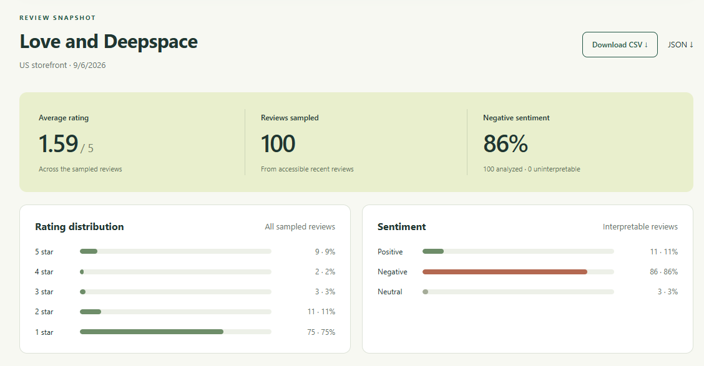
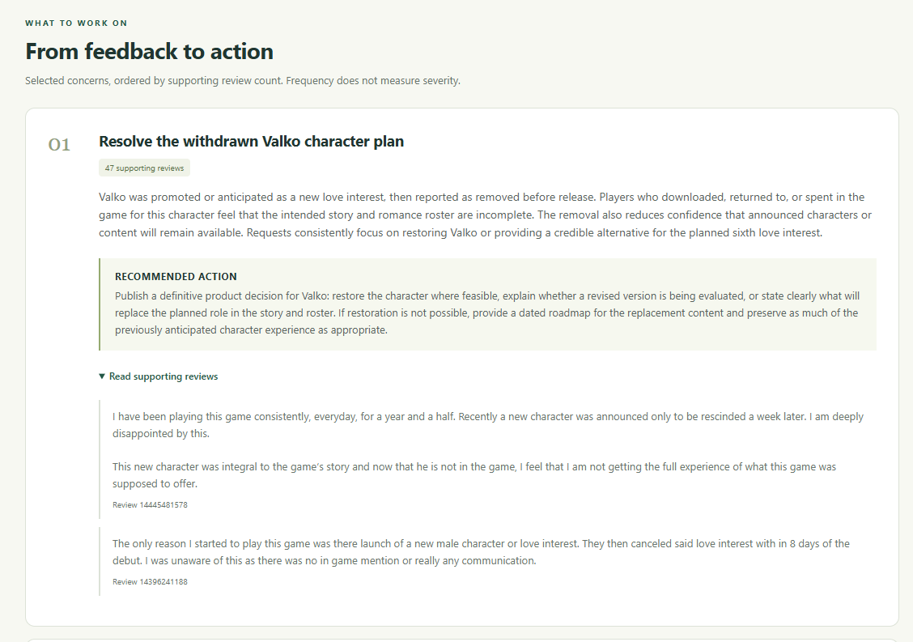
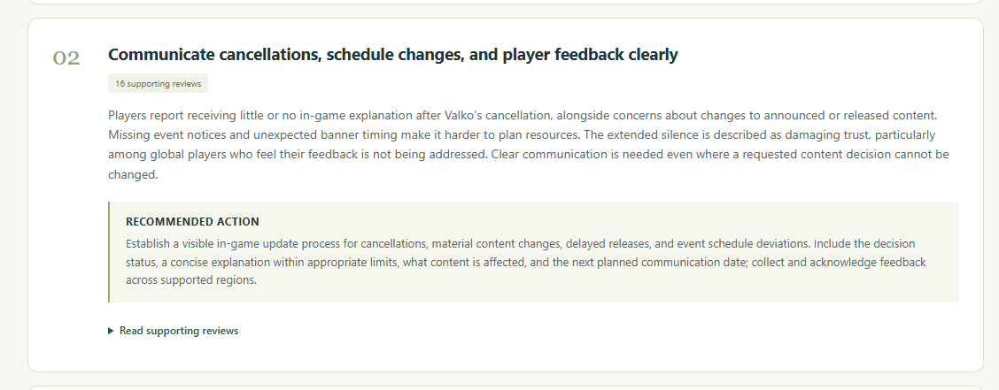
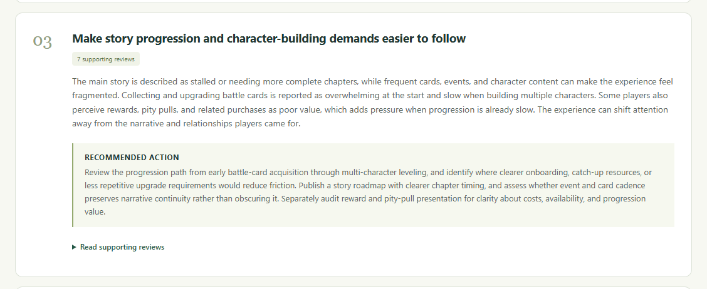
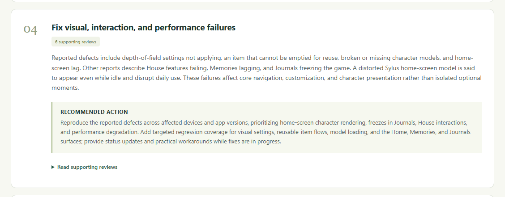
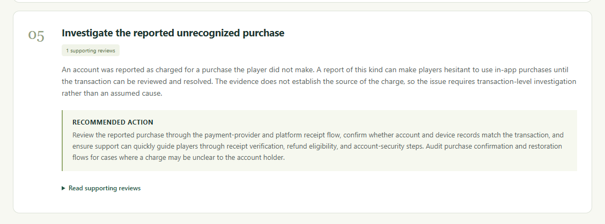
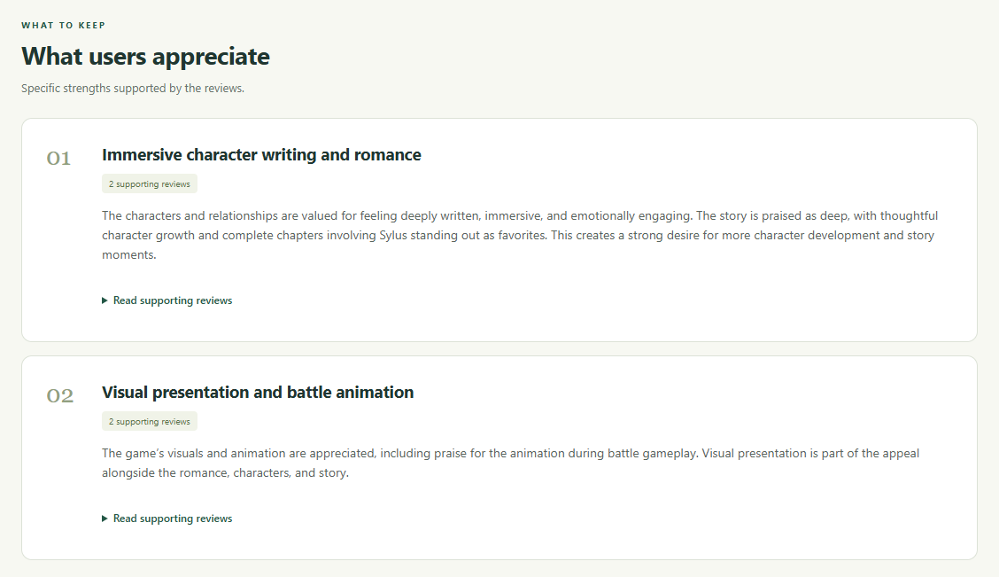
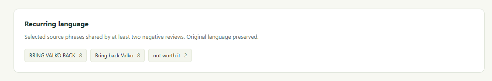

# App Store Review Analysis

Collect up to 100 random App Store reviews and view rating/sentiment charts, strengths,
complaints, recommendations, and supporting quotations.

## Live app

Open [App Store Review Analysis](https://apple-review-analysis.duckdns.org).
Hosted on AWS EC2 with Docker and Nginx. HTTPS certificates renew automatically;
HTTP requests redirect to HTTPS.

## Run locally

Requires Python 3.12–3.13 and [uv](https://docs.astral.sh/uv/).

1. Copy `.env.example` to `.env` (PowerShell: `Copy-Item .env.example .env`;
   macOS/Linux: `cp .env.example .env`). Keep an existing configuration.
2. Set `LLM_API_KEY` and `LLM_MODEL`.
3. From the project root, run:

   ```sh
   uv sync --locked
   uv run uvicorn review_analysis.app.api:create_app --factory --host 127.0.0.1 --port 8000
   ```

Open [the app](http://127.0.0.1:8000) or [API documentation](http://127.0.0.1:8000/docs).
Search, select an app, and choose **Analyze app**. Bookmark the report URL to reopen it.

Use one worker. Stop with **Ctrl+C** and restart after configuration changes. SQLite is
created at `data/reviews.sqlite3`. Without an AI key, collection, ratings, exports, and
reading saved reports still work.

Optional settings in `.env`: `LLM_BASE_URL` and `LLM_API` (`responses` or `chat`) select
a provider supporting structured JSON output. `DATABASE_PATH` changes storage;
`COLLECTION_TIMEOUT_SECONDS` and `ANALYSIS_TIMEOUT_SECONDS` default to 90 and 180 seconds.
For slower models, set `ANALYSIS_TIMEOUT_SECONDS=600`; provider reads follow that deadline
while connection attempts are limited to 10 seconds.

## How it works

1. **Collect:** validate the app/country and fetch up to ten recent-review pages from Apple.
2. **Prepare:** discard malformed entries, deduplicate by review ID, randomly sample up to
   100 reviews, and save the pool, selection, and seed.
3. **Analyze:** normalize Unicode and whitespace in titles and bodies; classify sentiment
   in batches of 20. A separate pass uses original excerpts to identify themes and strengths.
4. **Verify:** check classifications and source evidence, calculate statistics in Python,
   and save the report. Ratings and downloads remain available if analysis fails.

**Design:** FastAPI/Pydantic validate requests, SQLite preserves snapshots, Python performs
arithmetic, and the model interprets language. Plain browser JavaScript displays results;
no frontend build or separate database server is needed.

### Cleaning and analysis rules

- Require a review ID, string title/body, nonblank combined text, and a rating from 1–5.
  Skip invalid entries and count them. Keep the first valid occurrence of each review ID.
  Missing optional date/version becomes `null`.
- Normalize Unicode to NFC, collapse repeated whitespace, and trim text for sentiment input.
  Preserve case, punctuation, emojis, and negation. Original text stays intact for quotations
  and exports; the combined `cleaned_text` field checks the analysis-size limit.
- If fewer than 100 valid reviews exist, return those available with a warning. A genuinely
  empty feed can be saved but cannot be analyzed; a malformed feed returns an error.
- Uninterpretable reviews stay in ratings/exports but are excluded from sentiment percentages
  and themes, with coverage reported.
- Return up to five improvements and three strengths. Support counts are distinct reviews
  per theme and can overlap. Verify quotations against originals.
- Recurring phrases must match a source after normalization and be selected in at least
  two negative reviews. Up to 15 appear; counts are selected occurrences, not an exhaustive
  text search. Invalid optional phrases are discarded with a warning.

**Seeds and caching:** omitting `seed` generates a fresh random one. The same pool and seed
reproduce a sample; a changing Apple feed may not. Reuse a saved collection UUID to analyze
identical reviews. The same collection and analysis configuration return a cached result;
a different model/configuration generates another analysis through the API. Opening a saved
report displays its existing analysis; selecting an app collects a new random sample.

## API and errors

Use **Try it out** in `/docs`. All paths below start with `/api/v1`.

| Request | Purpose |
|---|---|
| `GET /apps/search?query=Love%20and%20Deepspace&country=us` | Find an app ID |
| `POST /collections` | Save reviews; return a collection UUID |
| `GET /collections/{id}` | Read metadata |
| `GET /collections/{id}/metrics` | Read rating statistics |
| `POST /collections/{id}/analysis` | Generate or reuse matching analysis |
| `GET /collections/{id}/analysis` | Read the latest saved report without an AI call |
| `GET /collections/{id}/analysis/details` | Read all evidence, labels, and provenance |
| `GET /collections/{id}/reviews?format=csv` | Export reviews; also supports `json` |

For collection, send `Content-Type: application/json` with
`{"app_id":6443467666,"country":"us"}`. Use the returned `id` in later requests.
Analysis requests need no body. `GET /health` checks API/database availability.

Invalid JSON, missing fields, unsupported countries, and invalid IDs return **422**.
Missing resources return **404**; empty samples or busy analysis **409**; malformed
upstream/AI output **502**; missing credentials, unavailable providers, or storage errors
**503**; deadlines **504**; unexpected failures **500**. Errors include `error.code`,
`error.message`, and a `request_id` also present in logs and the `X-Request-ID` header.

Apple transient failures get up to three attempts; the AI SDK retries retryable failures
up to twice. Invalid evidence gets one correction attempt. Failed analysis is not saved,
and retrying uses the existing review collection. Samples above 300,000 original or normalized
text characters are rejected rather than truncated. Each AI request also checks that budget
against serialized data, instructions, and output schema, including correction attempts.
Browser requests time out after 30 seconds for reads and 615 seconds for collection/analysis;
the latter allows the maximum configured server deadline. Reopen a saved report before retrying.

## Example: Love and Deepspace

Actual app screenshots from a saved US sample: **100 reviews**, collected **2026-09-06**.



Rating and sentiment distributions summarize this sample, not the app's lifetime rating.



Each improvement connects a reported concern to a proposed action and original review excerpts.



Communication concerns: 16 supporting reviews; proposed clearer notices and update dates.



Progression concerns: 7 supporting reviews; proposed reviewing card upgrades and story pacing.



Technical issues: 6 supporting reviews describing visual defects, lag, and freezes.



One purchase dispute needs investigation; the review does not establish the charge's cause.



Strengths highlight what users appreciate, with supporting-review counts.



Recurring language shows selected complaint phrases shared by at least two negative reviews.

Screenshots show a saved `multilingual-balanced-v7` analysis from `gpt-5.6-terra`.
Collection: `116f65a3-edd0-4dad-b048-d7775695a3db`. New installations do not include this data.

## Development

Code lives in `src/review_analysis/`: `app/` handles API/UI and configuration;
`reviews/` handles collection, cleaning, storage, and workflow; `analysis/` handles
prompts, model calls, evidence, and statistics.

To add a provider, implement [`StructuredLLM`](src/review_analysis/analysis/llm.py):
`model`, `identity`, and async `generate(prompt, data, schema)`, returning a validated
Pydantic result and input/output token counts. Wire it into
[`app/runtime.py`](src/review_analysis/app/runtime.py) and map expected failures to `AppError`.

```sh
uv run pytest
uv run ruff check src tests
uv run ruff format --check src tests
uv run mypy
```

Tests use mocked providers and cover collection, validation, evidence, caching, migrations,
and failure recovery. Back up running SQLite databases with its backup API before upgrading.
Startup migrates older databases to schema 3, preserving snapshots and enforcing non-null
collection IDs. Invalid legacy records stop migration and roll it back rather than being discarded.
